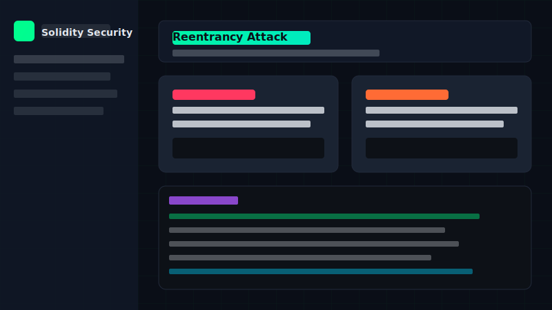

# 🔐 Solidity Security Cheatsheet

[](https://mariano-aguero.github.io/solidity-security-cheatsheet)
[](LICENSE)
[](https://soliditylang.org/)

A comprehensive, interactive security guide for Solidity and Ethereum smart contract development. Learn about common vulnerabilities, security patterns, and best practices.

## 🌐 Live Demo

[](https://mariano-aguero.github.io/solidity-security-cheatsheet)

**[View the Cheatsheet →](https://mariano-aguero.github.io/solidity-security-cheatsheet)**

## 📚 Contents

### Vulnerabilities (15+)
- 🔄 **Reentrancy** - Single, cross-function, cross-contract, read-only
- 💥 **Integer Overflow/Underflow** - Arithmetic exploits
- 🔑 **Access Control** - Permission bypass attacks
- 🎣 **tx.origin Phishing** - Authentication vulnerabilities
- 📞 **Unsafe Delegatecall** - Storage corruption
- 🏃 **Front-Running & MEV** - Transaction ordering attacks
- 🚫 **Denial of Service** - Blocking legitimate users
- 📊 **Oracle Manipulation** - Price feed attacks
- ✍️ **Signature Replay** - Reusing valid signatures
- 📡 **Unsafe External Calls** - Unchecked returns
- ⏰ **Timestamp Dependence** - Miner manipulation
- 🎲 **Weak Randomness** - Predictable sources
- 💰 **Force Feeding ETH** - Balance manipulation
- 💾 **Storage Collision** - Proxy upgrade issues

### Security Patterns
- Checks-Effects-Interactions (CEI)
- Pull over Push
- Emergency Stop (Circuit Breaker)
- Rate Limiting
- Commit-Reveal
- Guard Check

### Best Practices
- Variable declarations & visibility
- Function ordering & modifiers
- Custom errors (gas efficient)
- Event logging
- Gas optimization techniques

### Tools & Resources
- Static analysis (Slither, Mythril)
- Fuzzing (Foundry, Echidna)
- Formal verification (Certora)
- Monitoring (Tenderly, Defender)

## 🚀 Quick Start

### View Online
Simply visit the [GitHub Pages site](https://mariano-aguero.github.io/solidity-security-cheatsheet).

### Run Locally
```bash
# Clone the repository
git clone https://github.com/mariano-aguero/solidity-security-cheatsheet.git

# Open in browser
cd solidity-security-cheatsheet
open index.html
# or use a local server
python -m http.server 8000
```

## 🛠️ Setup GitHub Pages

1. Go to your repo **Settings** → **Pages**
2. Under "Source", select **Deploy from a branch**
3. Select **main** branch and **/ (root)** folder
4. Click **Save**
5. Your site will be live at `https://mariano-aguero.github.io/solidity-security-cheatsheet`

## 📖 Additional Resources

### Documentation
- [Solidity Docs](https://docs.soliditylang.org/)
- [OpenZeppelin Contracts](https://docs.openzeppelin.com/contracts/)
- [Chainlink Docs](https://docs.chain.link/)

### Security References
- [SWC Registry](https://swcregistry.io/) - Smart Contract Weakness Classification
- [Consensys Best Practices](https://consensys.github.io/smart-contract-best-practices/)
- [Trail of Bits Guidelines](https://github.com/crytic/building-secure-contracts)

### Practice
- [Damn Vulnerable DeFi](https://www.damnvulnerabledefi.xyz/)
- [Ethernaut](https://ethernaut.openzeppelin.com/)
- [Capture The Ether](https://capturetheether.com/)

### News & Analysis
- [Rekt News](https://rekt.news/) - DeFi hack postmortems
- [Immunefi](https://immunefi.com/) - Bug bounty platform

## 🤝 Contributing

Contributions are welcome! Please feel free to submit a Pull Request.

1. Fork the repository
2. Create your feature branch (`git checkout -b feature/new-vulnerability`)
3. Commit your changes (`git commit -m 'Add new vulnerability section'`)
4. Push to the branch (`git push origin feature/new-vulnerability`)
5. Open a Pull Request

### Contribution Ideas
- Add new vulnerabilities or attack vectors
- Improve code examples
- Add translations
- Fix typos or clarify explanations
- Add more real-world hack examples

## 📄 License

This project is licensed under the MIT License - see the [LICENSE](LICENSE) file for details.

## ⭐ Support

If you find this cheatsheet useful, please consider:
- Giving it a ⭐ star on GitHub
- Sharing it with other developers
- Contributing improvements

## 📬 Contact

- Create an [issue](https://github.com/mariano-aguero/solidity-security-cheatsheet/issues) for bugs or suggestions
- Follow for updates

---

<p align="center">
  Made with 🔐 for the Ethereum community
</p>
